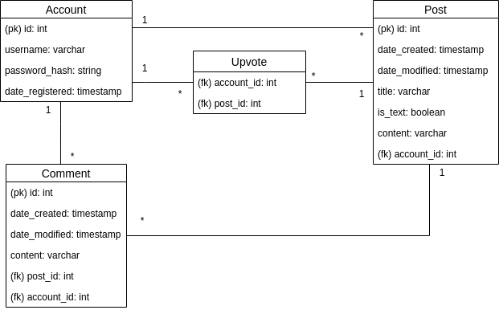

# social-news-site

## Description

A social news with a list of threads submitted by users. The list of threads can be sorted by date (newest first) or number of upvotes. Threads can be filtered to show all threads or only favorites. Registered users can create threads which include either a link to a news article or just text content. Users can also upvote threads, write comments to threads and add threads to their favorites.

## Database diagram

User can submit many threads but each thread has only one submitter. Users can also add many threads to favorites and threads can be favorited by many users. This relation is managed by a junction table called Favorite. Threads can have many comments but each comment belongs to a single thread. Users can write many comments but each comment is written by a single user. 

