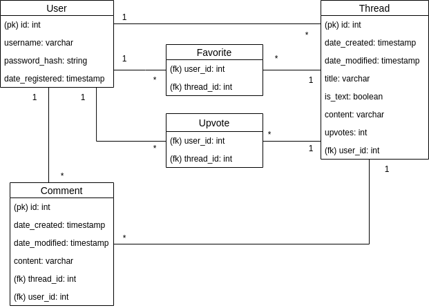

## Database diagram

User can submit many posts but each post has only one submitter. Users can also add many posts to favorites and posts can be added to favorites by many users. Users can also upvote many posts and posts may be upvoted by multiple users. Post contains a field called *upvotes* that keeps track of the number of upvotes a post has received. This field may be deleted in the future in favor of an aggregate query. Posts can have many comments but each comment belongs to a single post. Users can write many comments but each comment is written by a single user.