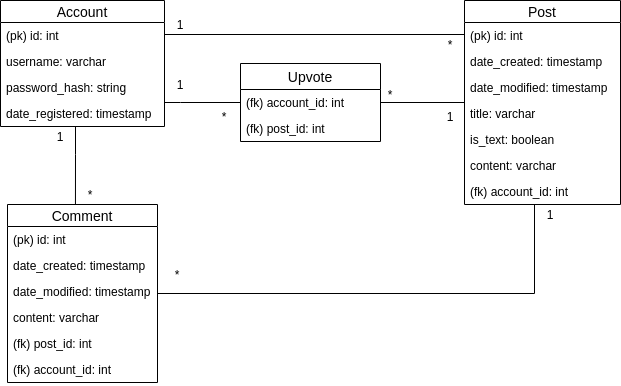

## Database diagram



User can submit many posts but each post has only one submitter. Users can also upvote many posts and posts may be upvoted by multiple users. Posts can have many comments but each comment belongs to a single post. Users can write many comments but each comment is written by a single user.

## CREATE TABLE statements

```sql
CREATE TABLE account (
        id INTEGER NOT NULL, 
        username VARCHAR(40) NOT NULL, 
        password_hash VARCHAR(255) NOT NULL, 
        date_registered DATETIME, 
        PRIMARY KEY (id), 
        UNIQUE (username)
)

CREATE TABLE post (
        id INTEGER NOT NULL, 
        date_created DATETIME, 
        date_modified DATETIME, 
        content VARCHAR(3000) NOT NULL, 
        title VARCHAR(255) NOT NULL, 
        is_text BOOLEAN NOT NULL, 
        account_id INTEGER NOT NULL, 
        PRIMARY KEY (id), 
        CHECK (is_text IN (0, 1)), 
        FOREIGN KEY(account_id) REFERENCES account (id)
)

CREATE TABLE comment (
        id INTEGER NOT NULL, 
        date_created DATETIME, 
        date_modified DATETIME, 
        content VARCHAR(3000) NOT NULL, 
        post_id INTEGER NOT NULL, 
        account_id INTEGER NOT NULL, 
        PRIMARY KEY (id), 
        FOREIGN KEY(post_id) REFERENCES post (id), 
        FOREIGN KEY(account_id) REFERENCES account (id)
)

CREATE TABLE upvote (
        account_id INTEGER NOT NULL, 
        post_id INTEGER NOT NULL, 
        PRIMARY KEY (account_id, post_id), 
        FOREIGN KEY(account_id) REFERENCES account (id), 
        FOREIGN KEY(post_id) REFERENCES post (id)
)
```